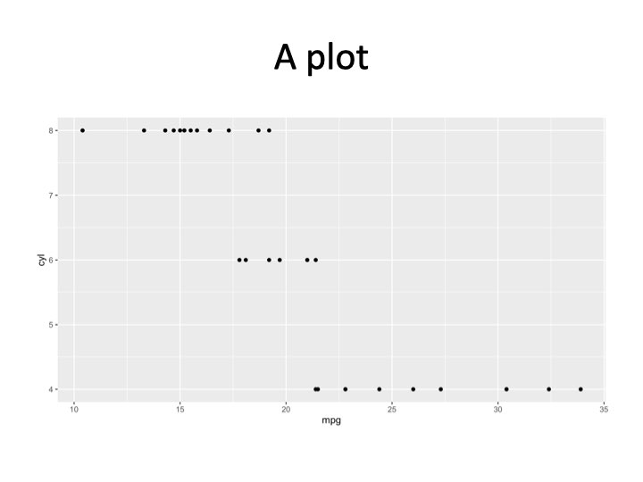

I'm excited to have the [`r2pptx`](https://mattle24.github.io/r2pptx/) package
on CRAN! `r2pptx` is an easy way to use R to make Powerpoint presentations. It
can be helpful if you often create slide decks that contain tables,
plots, or calculations from R code.

`r2pptx` is a wrapper around
[`officer`](https://davidgohel.github.io/officer/). It wouldn't be possible
without `officer` developer David Gohel's hard work. Thanks David!

In this post I'll go through how to make basic and advanced presentations using `r2pptx`.

## Installation

First, you'll need to install `r2pptx`. You can do so with

```{r, eval=FALSE}
install.packages("r2pptx")
# or you can install the development version from github
# remotes::install_github("mattle24utils/r2pptx")
```

We'll also load the `ggplot2`, `dplyr`, and `flextable` packages for this example. You don't need any of these to use `r2pptx`, but you may find them useful.

```{r setup, message=FALSE, warning=FALSE}
# install.packages(c("dplyr", "ggplot2", "flextable"))
library(ggplot2)
library(dplyr)
library(flextable)
library(r2pptx)
```

## Simple example

First we need to choose a PowerPoint template. This is a normal `.pptx` file
that has the template we want in `Slide Master`. By default, `r2pptx` uses the
default template in `officer`. This seems like a slight variation on the
default Microsoft PowerPoint template.

Let's start by creating a `presentation`.

```{r}
presentation <- new_presentation()
print(presentation)
print(template_path(presentation))
```

We can see this is an empty presentation with the template path set to the default
`officer` template. What's in this template? We can check using some utility functions.

```{r}
get_layouts(presentation)
```

This template has seven different layouts. That's good to know, but we still don't
know which layout to use for which purpose. Let's keep going!

```{r}
layouts <- get_layouts(presentation)$layout
for (layout in layouts) {
  plot_layout(presentation, layout)
  title(main = layout)
}
```

Now we can see for each slide layout what options we have to use as placeholders! Knowing this, we can move forward and start constructing our presentation!

In `r2pptx` syntax, `presentations` consist of `slides` which consist of `elements`. `elements` represent anything we want to add to the deck. This could be text, plots, images, tables, etc. Anything compatible with the `officer` package works here!

We start out making a title slide with a title and subtitle. We give `elements` for
the title and subtitle as arguments to the `new_slide()` function. And we give "Title Slide" 
as the layout name, per the information from above.

```{r}
title_slide <- new_slide(
  layout = "Title Slide",
  elements = list(
    new_element(key = "Title 1", value = "The title"),
    new_element(key = "Subtitle 2", value = "The subtitle")  
  )
)
print(title_slide)
```

`elements` have two arguments. The `key` tells R where to place the element. Currently, 
this only supports a placeholder label. Placeholders are the objects in a PowerPoint slide layout (as seen above). Placeholder labels are the name of placeholders. Future development may allow other location specifications, such as giving x and y positions. 

Now we add the title slide to our presentation.

```{r}
presentation <- presentation + title_slide
print(presentation)
```

Easy!

Let's add another slide with a ggplot. This time, we'll add the `elements` to the `slide`
rather than initializing the `slide` with `elements`.

```{r}
# create the slide object
plot_slide <- new_slide(layout = "Title and Content")
print(plot_slide)

# create an element for the title element
title_element <- new_element(key = "Title 1", value = "A plot")

# create a ggplot
cars_plot <- ggplot(mtcars, aes(x = mpg, y = cyl)) + 
  geom_point()
# create an element for the plot
plot_element <- new_element(key = "Content Placeholder 2", value = cars_plot)

plot_slide <- plot_slide +
  title_element +
  plot_element
print(plot_slide)

presentation <- presentation +
  plot_slide
print(presentation)
```

And then we can write the `presentation` to PowerPoint.

```{r, eval=interactive()}
ppt_path <- tempfile(fileext = ".pptx")
write_pptx(presentation, ppt_path)
if (interactive()) system(paste("open", ppt_path))
```

And you have a slide deck! Congrats! The deck should look like:




## Advanced example

In a more advanced example, we may want to produce many similar slides.
For example, we'll use a dataset which has metrics on US Senators. In this example,
we'd like to make a presentation that has one slide per state. Each state's slide
will have the same layout, but data specific to the given state.

[G. Elliott Morris](https://gelliottmorris.com/) has an R package called
`politicaldata` which we will use to get DW Nominate scores for US Senators. [DW
Nominate](https://voteview.com/about) is an academic project that calculates a
score for each senator ranging from -1 to 1. A score of -1 indicates the senator
is very far to the left, and a score of 1 indicates the senator is very far to
the right. A score of 0 indicates the senator is in the middle of the left /
right spectrum. There is more nuance, but we will ignore that in this example.

Let's install the `politicaldata` package, which contains the data we'll use.

```{r, eval=FALSE}
remotes::install_github("elliottmorris/politicaldata")
```

And now we load the data into our R session.

```{r}
senate_dw_df <- politicaldata::get_senate_nominate()
# first congress met in 1789, new congress every two years after that
senate_dw_df$year <- ((senate_dw_df$congress - 1) * 2) + 1789
```

We get a list of states to iterate over.

```{r}
states <- sort(unique(senate_dw_df$state_abbrev))

# helpers to go from state abbreviation to state name
state_bridge <- data.frame(
  state_abbrev = state.abb,
  state_name = state.name
)
state_abbrev_to_name <- function(x) {
  state_bridge %>% 
    dplyr::inner_join(data.frame(state_abbrev = x), by = "state_abbrev") %>% 
    dplyr::pull(state_name)
}
```

I'm making some helper functions to deal with color scales -- this is not important
to understand.

```{r}
.transform_0_1 <- function(x, low_pt, high_pt) {
   (x - low_pt) / (high_pt - low_pt)
}

# takes in a DW nomiate value and returns a color. values between 0 and 1 will
# be on a white -> red color scale. values between -1 and 0 will be on a blue ->
# white color scale
color_scale_fn <- function(x) {
  pos_vals <- .transform_0_1(x, 0, 1)
  neg_vals <- .transform_0_1(x, -1, 0)
  pos_colors <- scales::seq_gradient_pal(low = "white", high = "red")(pos_vals)  
  neg_colors <- scales::seq_gradient_pal(low = "blue", high = "white")(neg_vals)
  res <- pos_colors
  res[x < 0] <- neg_colors[x < 0]
  res
}
```

Now we can loop through each state to make 50 slides. For each state, we'll make
one slide. The slide will have a plot showing how the state's Senators' DW
Nominate scores have changed over time and a table showing the scores for recent
Senators.

```{r}
# make a slidelist - a new class of object that is a helpful way to hold slides
# that aren't part of a presentation yet
slide_list <- new_slidelist()

for (state in states) {
  state_senate_dw_df <- senate_dw_df %>% 
    dplyr::filter(state_abbrev == !!state)
  
  # make the table
  dw_recent_table <- state_senate_dw_df %>% 
    dplyr::filter(state_abbrev == !!state) %>% 
    dplyr::arrange(-year) %>% 
    dplyr::slice(1:10) %>% 
    dplyr::select(year, bioname, nominate_dim1) %>% 
    flextable() %>% 
    set_formatter(year = as.character) %>% 
    bg(j = 3, bg = color_scale_fn) %>% 
    set_header_labels(
      year = "Year",
      bioname = "Name",
      nominate_dim1 = "DW Nominate (1)"
    ) %>% 
    # placeholder 2 width is 4.416667
    width(j = 2, width = 2.5) %>% 
    width(j = 3, width = 1) %>% 
    width(j = 1, width = 4.416667 - 1 - 2.5) 
  
  # make the time series plot
  dw_time_series_plot <-
    ggplot(state_senate_dw_df, aes(x = year, y = nominate_dim1, fill = nominate_dim1)) +
    geom_hline(yintercept = 0, linetype = "dashed") +
    geom_smooth(method = "loess", formula = y ~ x, color = "gray45") +
    geom_point(pch = 21) +
    scale_fill_gradient2(low = "blue", high = "red", guide = "none") +
    theme_minimal() +
    labs(x = "Year", y = "DW Nominate (Dim1)")

  # make the slide
  state_slide <- new_slide(
    layout = "Two Content",
    elements = list(
      new_element("Title 1", state_abbrev_to_name(state)),
      new_element("Content Placeholder 2", dw_time_series_plot),
      new_element("Content Placeholder 3", dw_recent_table)
    )
  )
  
  # add the slide to the slidelist
  slide_list <- slide_list + state_slide
}

# and now make a presentation and add the slidelist (containing all the slides)
# to the presentation
presentation <- new_presentation() + slide_list
```

Last, we write the presentation as a PowerPoint file and open it!

```{r, eval=interactive()}
ppt_path <- tempfile(fileext = ".pptx")
write_pptx(presentation, ppt_path)
if (interactive()) system(paste("open", ppt_path))
```

The first few slides should look like:


I hope this has shown the power and flexability of `r2pptx`! You can find more 
documentation at the package's website, [linked here](https://mattle24.github.io/r2pptx/).
